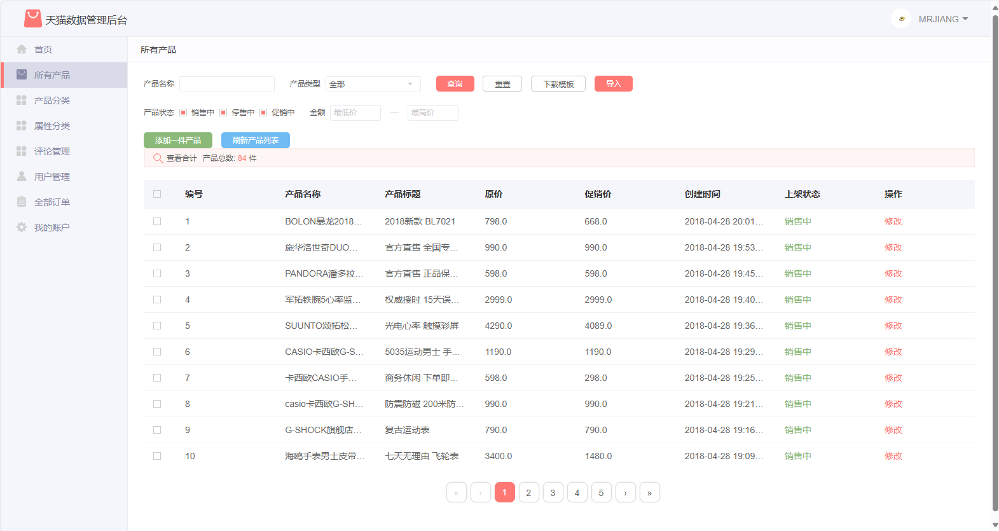
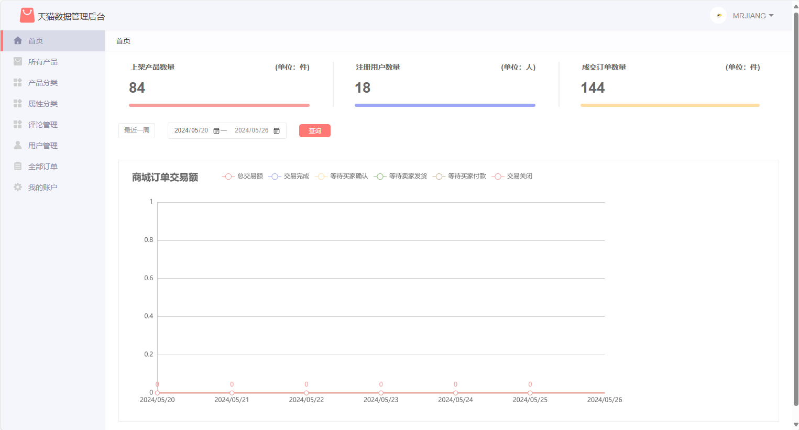
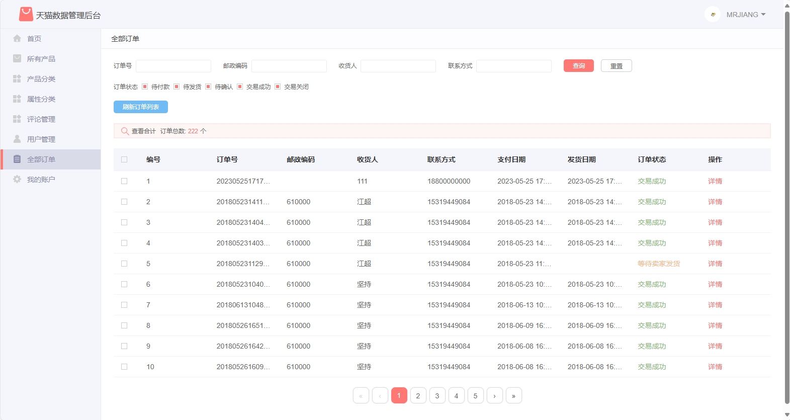
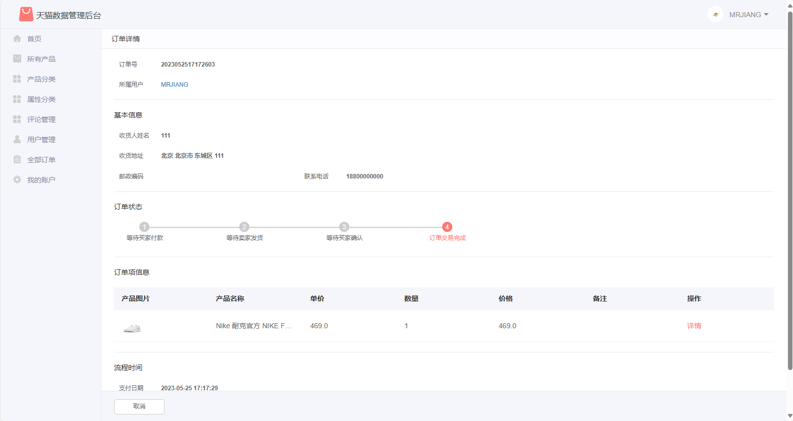

# Imitation Tmall Mall
Mini Tmall Mall is a comprehensive B2C e-commerce platform based on the SSM framework. The requirements design mainly refers to the shopping process of Tmall Mall: users start from registration, complete login, browse products, add to the shopping cart, place orders, confirm receipt, and evaluate a series of operations. As one of the core components of the simulated Tmall mall system, the Tmall data management backend using the SSM framework includes modules such as product management, order management, category management, user management, and transaction volume statistics, achieving one-stop management and maintenance of the entire mall. (For reference only, if you have any questions, please forgive me! If you think it's good, please help recommend it. Thank you all handsome guys and beautiful women!)

The backend page is compatible with modern browsers such as IE10 and above, and Chrome, Edge, and Firebox perform best.

# Deployment method(Master - Basic version, feature1.0- Newer version)
1. The project is developed using IntelliJ IDEA, please use the version control checkout function of IntelliJ IDEA, enter“ https://gitee.com/HaiTao87/TmallDemo.git ”Just pull the item. 
2. The project database master is divided into MySQL version 5.7, and the feature is divided into MySQL version 8.0 and above. Please download the SQL file from the attachment of Code Cloud or the SQL folder under Resources and import it into the database. 
3. After opening the project using IDEA, refresh the project in the Maven panel and download the dependency package. (Project jdk is 1.8) 
4. Start the springboot project in IDEA (either in run or debug mode).
5. Please refer to the attached SQL file for the account name and password, or the SQL file in the SQL folder under Resources (explained below the account password on the front-end and back-end pages).
   The master branch database SQL is as follows:
   

   The feature branch database SQL is as follows:
   

6. Swagger interface document address: http://localhost:8082/tmall/swagger-ui.html

7. Druid Monitor Monitoring address：http://localhost:8082/tmall/druid/sql.html (Account: admin Password: 123456)

Attention: It is normal for the order chart in the backend management interface to have no data. The chart displays the transaction volume for the past 7 days.

---Background interface (partial) - Access address: http://localhost:8082/tmall/admin/login (The account name and password are in the admin table)

---Front end interface (partial) - Access address http://localhost:8082/tmall/login (Account name and password in the user table)

